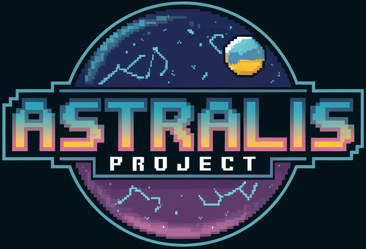

# Astralis

## Cos'è Astralis?

**Astralis** è un progetto open-source per creare un **MMO voxel** ispirato a Minecraft, con l'obiettivo di sviluppare un
motore modulare, estensibile e supportato da un linguaggio di scripting **LUA**. Astralis punta a offrire un'esperienza unica
di esplorazione e costruzione, permettendo ai giocatori di viaggiare tra universi e pianeti diversi in uno stile voxel.

---

## Obiettivi principali

- **Motore MMO modulare:** Sviluppare un motore flessibile che supporti la creazione di contenuti personalizzati grazie al
  linguaggio di scripting LUA.
- **Esplorazione di universi:** Creare un mondo voxel infinito che consenta ai giocatori di esplorare pianeti e universi
  diversi.
- **Community-oriented:** Coinvolgere la community nelle decisioni per l'evoluzione del progetto.
- **Open-source:** Permettere alla community di forkare, estendere e migliorare il progetto.

---

## Tecnologie utilizzate

- **C#:** Linguaggio di programmazione principale per il backend e la logica del motore.
- **Unity:** Piattaforma per lo sviluppo del client del gioco con funzionalità 3D e voxel.
- **LiteNetLib:** Libreria per la gestione del networking multiplayer.

---

## Come contribuire

**Astralis** è un progetto community-oriented. Insieme alla community, decideremo come far evolvere il progetto. Se vuoi
partecipare:

1. Forka il progetto.
2. Crea una nuova branch per le tue modifiche.
3. Invia una pull request con una descrizione chiara delle tue modifiche.

Unisciti al nostro server Discord per discutere idee, suggerimenti e
contributi: [Discord Astralis](https://discord.gg/EcrUvgnq)

---

## Licenza

Questo progetto è distribuito sotto la licenza MIT. Consulta il file `LICENSE` per maggiori dettagli.
